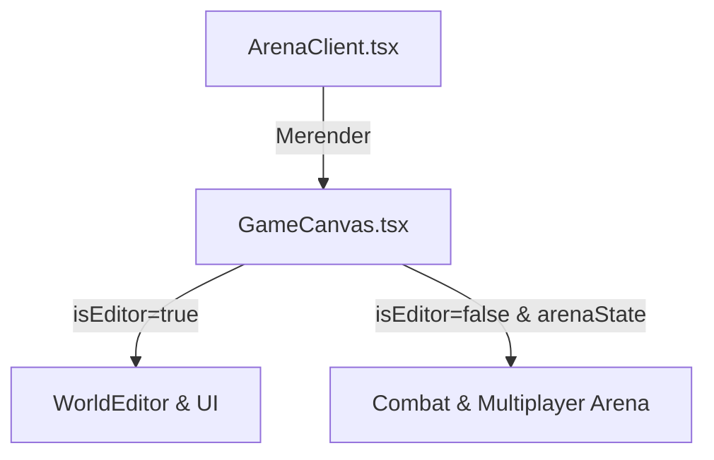

# Plan: Arena Overhaul & Canvas Unification

Perombakan besar-besaran untuk memindahkan dan menyatukan seluruh infrastruktur 3D rendering halaman Arena (`/arena`) ke dalam component terpadu `GameCanvas.tsx` yang saat ini digunakan oleh World Editor.

## Masalah Saat Ini (Redundansi Kode)
Halaman `/arena` (`ArenaClient.tsx`) dan `/world-editor` (`GameCanvas.tsx`) memiliki dua Canvas R3F terpisah yang menduplikasi banyak setup dasar:
1. Inisialisasi Canvas (powerPreference, stencil, antialias, power saving, dsb).
2. Lighting & Environment (`EnvironmentMultiGlobal`, `Minimap`, `CameraOcclusionManager`).
3. Post-processing (`SafePostProcessing` vs `OptimizedPostProcessing`).
4. VFX & Model preloader.

Dengan menyatukan keduanya di bawah `GameCanvas.tsx`, kita mendapatkan satu Canvas berperforma tinggi yang konsisten untuk seluruh aplikasi.

---

## Rencana Perombakan & Refactoring

### Langkah 1: Modifikasi `GameCanvas.tsx`
- Tambahkan properti opsional `arenaState` pada `GameCanvasProps` untuk menampung seluruh state multiplayer/combat dari `useArenaGameState()`.
- Pindahkan rendering modul-modul Arena berikut dari `ArenaClient.tsx` ke dalam Canvas `GameCanvas.tsx` (dibuat bersyarat jika `isEditor={false}` dan `arenaState` tersedia):
  - `VFXProvider`
  - `ModelsPreloader`
  - `PlayerController`
  - `RemotePlayersRenderer`
  - `RemoteMonstersRenderer`
  - `DamageHUDBatcher`
  - `ArcherTrapSystem`
  - Spell Effects (`BeginnerSpellEffect`, `FighterSpellEffect`, dsb)
  - `Minimap` (opsional di Canvas jika dibutuhkan, atau tetap di UI overlay)
  - `FPSCounterUpdater` & `Stats`

### Langkah 2: Refactor `ArenaClient.tsx`
- Hapus seluruh tag `<Canvas>` manual dan komponen internal R3F dari `ArenaClient.tsx`.
- Impor dan render `<GameCanvas isEditor={false} settingsRef={state.settingsRef} arenaState={...} />`.
- Pertahankan UI HUD overlay (Chat, SkillBar, Inventory, Stats Modal, dsb) tetap berada di layer DOM HTML `/arena`.

---

## Todo List

- [ ] **1. Extend Interface `GameCanvasProps`**
  - Definisikan tipe `ArenaState` untuk menampung semua references dari `useArenaGameState()`.
  - Tambahkan `arenaState?: ArenaState` ke dalam prop `GameCanvasProps`.
  
- [ ] **2. Integrasi Canvas Elements ke `GameCanvas.tsx`**
  - Impor komponen combat arena (`PlayerController`, `RemotePlayersRenderer`, `RemoteMonstersRenderer`, dsb) ke `GameCanvas.tsx`.
  - Susun struktur render bersyarat di dalam `<Canvas>` `GameCanvas.tsx` untuk memilah editor components vs arena components.
  - Bungkus arena components dengan `<VFXProvider>` di dalam Canvas `GameCanvas.tsx`.

- [ ] **3. Update `ArenaClient.tsx` untuk Menggunakan `GameCanvas`**
  - Bersihkan inisialisasi Canvas R3F manual.
  - Kirim object `arenaState` dari hook `state` ke component `<GameCanvas />`.
  
- [ ] **4. Verifikasi dan Pengujian**
  - Jalankan `bunx tsc --noEmit` untuk memastikan tidak ada kesalahan kompilasi tipe data.
  - Uji gameplay di `/arena` untuk memastikan pergerakan player, monster, spell effects, dan culling berjalan normal di bawah Canvas terpadu yang baru.
