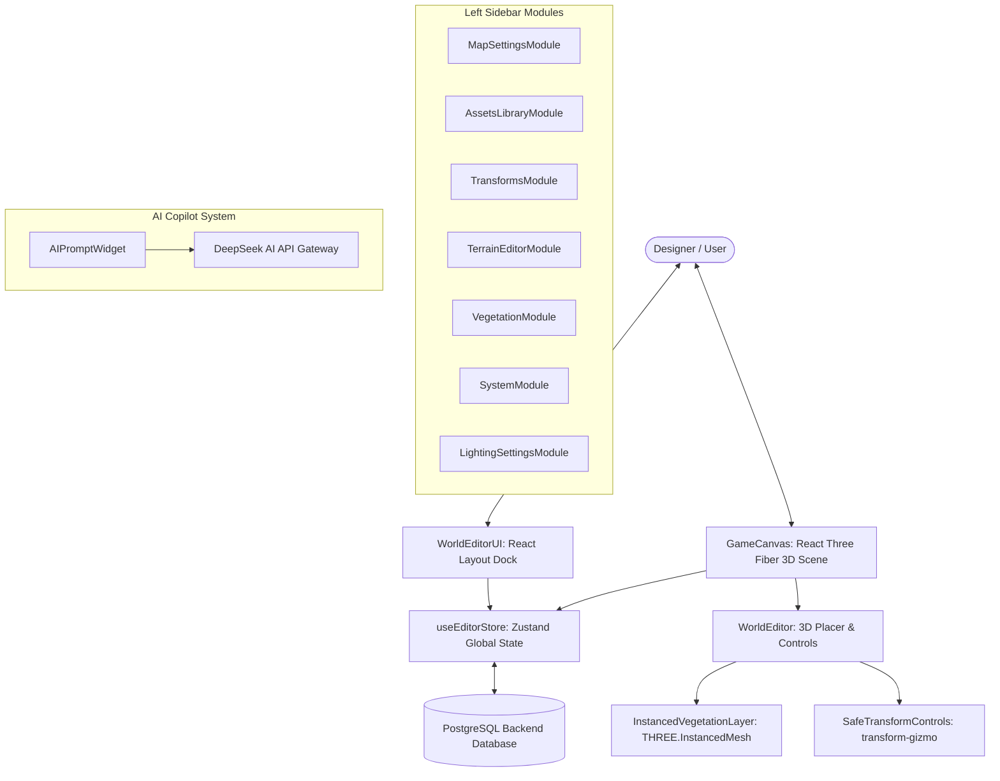
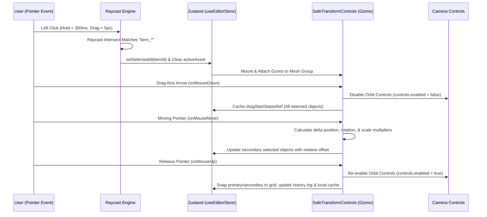

# 🎨 Jagres Map Studio: Complete Feature Documentation

Jagres Map Studio is a premium, real-time 3D level editor and world-building studio. It is crafted following Clean Architecture principles to provide game developers and designers with high-performance tools for terrain sculpting, asset placement, and AI-assisted procedural map generation.

---

## 🏗️ System Architecture & Data Flow

---

## 🔄 Deep-Dive: Object Editing Lifecycle

When a designer edits an object inside the 3D studio, a highly robust, multi-stage synchronization pipeline is activated across the React virtual DOM, R3F WebGL renderer, and Zustand state buffers:

### 1. Separation of Taps vs. Camera Drags

- **The Problem**: In a 3D editor, dragging the mouse is used to rotate the camera. A simple click-listener would falsely trigger object selection or deselection whenever the designer pans around.
- **The Solution**: The editor implements a **tap-to-drag validation threshold** using `pointerStartRef`. It caches the screen coordinate `[clientX, clientY]` and a timestamp on `pointerdown`. On `pointerup`, it calculates:
    - `elapsedTime = Date.now() - startTime`
    - `displacementDistance = Math.hypot(currentX - startX, currentY - startY)`
    - If `elapsedTime > 300ms` or `displacementDistance > 5px`, it classes the action as a camera sweep and completely ignores selection updates.

### 2. Raycast Intersection Parsing & Hierarchy Traversal

- When a tap is validated, the camera casts a projection ray from screen space `(mouse.x, mouse.y)` into the 3D world space.
- **Gizmo Bypass**: If the ray intersects a gizmo element (`TransformControlsPlane`), the action is ignored because the user is manipulating the movement arrows.
- **Parent Tree Traversal**: A GLTF model consists of nested sub-meshes. Clicking a leaf mesh (like a leaf on a tree) would return the leaf's mesh object. The raycast engine recursively traverses up the parent tree (`cur = cur.parent`) until it hits a group node containing an `id` prefixed with `item_` (which is mapped to the Zustand database entry).

### 3. State Inversion (Mode Switching)

- As soon as a placed object is selected, `setSelectedId(itemId)` is triggered.
- If the designer was previously in "Placement Mode" (carrying a holographic ghost preview), the editor automatically clears `activeAsset` to `null`.
- This instantly sweeps the ghost mesh out of the scene and enters **"Edit Mode"**, expanding the Inspector panel for the active selection.

### 4. Interactive Delta Dragging (Multi-Object Alignment)

- **Orbit Lock**: The moment a transform axis arrow is grabbed (`onMouseDown`), Orbit Controls are disabled so that dragging the mesh doesn't rotate the camera.
- **Multi-Select Deltas**: Moving multiple objects together can easily cause performance stalls if state is committed constantly. To solve this, on dragging, the system:
    1. Caches starting coordinates of all selected items inside `dragStartStatesRef`.
    2. Calculates the absolute change (e.g. `deltaX = currentPositionX - startingPositionX`) of the primary clicked object.
    3. Translates, scales, or rotates all other selected secondary objects dynamically in real time relative to this delta offset!
- **Release & Commit**: On `onMouseUp`, the Orbit Controls are re-enabled, the final coordinates are snapped to the active grid coordinates (`snap(...)`), and the changes are logged as a unified state change in the **Undo/Redo History** to prevent separate state commits.
- **Smart Palette Sync**: The absolute scale and rotation values are cached in `lastUsedScales` and `lastUsedRotations` so that future placements of the same asset automatically match the recently customized dimensions.

---

## 🕹️ Interactive 3D Canvas Features

The main 3D viewport provides an intuitive, high-fidelity interactive sandbox with the following core features:

### 1. 🎯 Raycast-to-Ground Detection

- Utilizes a throttled, GPU-accelerated raycast engine to capture the cursor's intersection with the landscape in real-time.
- Resolves highly accurate coordinates `[X, Y, Z]` on deforming terrains to allow perfect alignment of visual items on slopes and mountains.

### 2. 🔮 Holographic Neon Ghost Previews

- When selecting an asset from the blueprints deck, a semi-transparent, glowing neon indigo **Ghost representation** of the 3D model hovers dynamically under the cursor.
- Enables designers to preview the exact rotation, size, and spatial boundaries of the object before committing it to the scene.

### 3. 🛠️ Safe Transform Control Gizmos (`SafeTransformControls`)

- Provides dynamic 3D arrows and rings directly in the viewport to perform **Translation** (movement), **Rotation** (spinning), and **Scale** changes.
- **Safe-Attachment Engine**: Periodically checks the scene tree to prevent unmounting and detached-child warning logs, preserving console hygiene.

### 4. 🔲 Multi-Object Selection

- Holding down the `Shift` key while clicking allows designers to select multiple 3D models concurrently.
- Selected items display a glowing indigo indicator ring around their bases and can be translated or deleted simultaneously.

### 5. 📏 Grid Snapping & Alignments

- Supports toggleable, multi-resolution grid snapping (`0.25m`, `0.5m`, `1.0m`, `2.0m` increments).
- Enables rapid construction of modular levels (e.g. aligning walls, gates, and roads cleanly).

### 6. ⌨️ Keyboard Coordinate Nudge

- Allows nudging selected items precisely along any axis using standard keyboard keys (see shortcut dictionary).

---

## 📁 Sidebar Dock Modules (Left Panel)

The left side of the workspace acts as an inspector dock and control center, divided into seven accordion panels:

### 1. 🗺️ Map Settings Module (`MapSettingsModule.tsx`)

- **Workspace Switching**: Lists all saved maps inside GORM database and allows hot-swapping workspaces.
- **Circular Parameter Dials**: Sleek, circular dial controllers to tune Grid Resolution and Snap Modes.
- **Save/Restore Interface**: Interactive save triggers that persist layout elements to Go PostgreSQL backend maps tables.

### 2. 📚 Blueprints Asset Library (`AssetsLibraryModule.tsx`)

- **Previews**: Visual gallery grid of models fetched dynamically from the database.
- **Model Categories**: Divided into logical folders:
    - _Kingdom_: Stone castle walls, round fortress towers, double gates, stone ruins, and bridges.
    - _Vegetation_: Pine trees, birches, foliage clumps, mossy boulders, and mushrooms.
    - _Props_: Legendary chests, weapons, torches, and decorative tables.

### 3. 📐 Mesh Transforms Module (`TransformsModule.tsx`)

- **Precision Inspector**: Text inputs to view and specify exact coordinates `[X, Y, Z]`, rotations `[Yaw, Pitch, Roll]`, and scale ratios.
- **Hex Color Tint Overrides**: An aesthetic color palette selector that lets designers inject custom hex tints into mesh materials (e.g., creating blue-leaved trees or gold-gilded castle stones).

### 4. 🏔️ Terrain Sculpting & Painting (`TerrainEditorModule.tsx`)

- **Deformation Sculpting**: Raises or lowers the height of the landscape vertices.
- **Brushing Colors**: Blends ground textures and colors (grassy green, volcanic ash, stone pathways) onto the vertex map.
- **Interactive Ring overlays**: A custom R3F mesh ring overlay follows the cursor, visualizing the active brush size and strength settings.
- **Detailed Documentation**: For a complete list of tools, configurations, brush masks, procedural generator variables, and shortcut list, see [TERRAIN.md](file:///home/yoga/Dokumen/game%20mmorpg/frontend/app/world-editor/TERRAIN.md).

### 5. 🌿 Instanced Vegetation Layer (`VegetationModule.tsx`)

- **Instanced Painting**: Sprays massive grass fields and dense pine forests with a single click.
- **Zero-Overhead WebGL Instancing**: Automatically groups thousands of identical models into single GPU draw calls (`InstancedMesh`), allowing rich organic environments to run at a lock-steady 60 FPS.

### 6. ☀️ Atmosphere & Lighting settings (`LightingSettingsModule.tsx`)

- **Atmosphere control**: Calibrates Sun angle, Shadows configurations (using optimized PCFShadowMap), Ambient light colors, Fog densities, and Camera Exposure parameters.
- **Dynamic Skyboxes**: Automatically changes skybox textures (sunset, night, whimsical) to match active environment modes.

### 7. 💾 Workspace Operations (`SystemModule.tsx`)

- **Undo & Redo Logging**: Full undo/redo logging array capturing up to 100 recent design actions.
- **JSON Blueprint Interop**: Import or export maps as portable, offline JSON strings.
- **Memory Flush**: Trashes local variables, resets the camera, or clears temporary VFX caches cleanly.

---

## 🤖 DeepSeek AI Generative Studio Features

The right panel features a premium AI level-design assistant powered by the **DeepSeek API Gateway**:

### 1. Natural Language Level Translation

- Designers write prompts describing what they want (e.g. _"Build a circular fortress surrounded by thick birches, with a gold treasure chest right in the center"_).
- DeepSeek translates this prompt into a highly structured JSON placement list containing coordinates, scales, rotations, and lighting parameters.

### 2. Generative Timeline Canvas UI

- Visualizes the AI's background execution process step-by-step in a premium, animated timeline overlay:
    - 🔍 **Step 1: Parsing Level Designer Intent** (decodes prompt theme).
    - 📂 **Step 2: Selecting 3D Asset Blueprints** (matches items with database asset paths).
    - 📐 **Step 3: Calculating Spatial Coordinates** (randomizes scattered models without intersections).
    - 🛡️ **Step 4: Executing Collision Integrity Verification** (validates boundaries).
    - 🌦️ **Step 5: Calibrating Atmospheric Lighting** (injects matching fog, sky, and exposure).
    - ⚡ **Step 6: Committing WebGL Spawns** (renders elements onto the active scene).

### 3. Append vs Replace Smart Modes

- **Append Mode**: Adds AI-generated structures on top of the designer's existing map layout.
- **Replace Mode**: Wipes the current workspace clean to build a fresh scene from scratch.

---

## ⌨️ Keyboard Shortcuts Dictionary

Ensure rapid workflows with these integrated, context-aware keyboard mappings:

| Hotkey / Shortcut               | Scope / Context  | Action                                                            |
| :------------------------------ | :--------------- | :---------------------------------------------------------------- |
| `Ctrl + Z`                      | Editor Workspace | **Undo** last placement/mutation                                  |
| `Ctrl + Y` / `Ctrl + Shift + Z` | Editor Workspace | **Redo** last undone action                                       |
| `Delete` / `Backspace`          | Selected Object  | **Remove/Delete** selected placed assets                          |
| `Arrow Left` / `Arrow Right`    | Selected Object  | Nudge position along X-axis (`+/- 0.1m`, Hold `Shift` for `0.5m`) |
| `Arrow Up` / `Arrow Down`       | Selected Object  | Nudge position along Z-axis (`+/- 0.1m`, Hold `Shift` for `0.5m`) |
| `PageUp` / `PageDown`           | Selected Object  | Nudge position along Y-axis (`+/- 0.1m`, Hold `Shift` for `0.5m`) |
| `Escape`                        | Active Selection | Clear active object selection or cancel active prompt             |
| `[`                             | Terrain Painting | **Decrease** brush size                                           |
| `]`                             | Terrain Painting | **Increase** brush size                                           |
| `-`                             | Terrain Painting | **Decrease** brush strength                                       |
| `+` / `=`                       | Terrain Painting | **Increase** brush strength                                       |

---

## ⚡ Under-the-Hood Performance Protections

1. **Active Raycast Bypass**: Viewport raycasting loops are bypassed when the cursor hovers over React HTML sidebar panels, protecting the CPU from redundant intersections.
2. **Dynamic Level of Detail (LOD)**: Disables shadow maps and bloom dynamically if performance drops below 53 FPS to stabilize the rendering cycle.
3. **Safe Memory Cleanup**: Unregisters and disposes geometries and materials from GPU memory when deleting assets to prevent memory leaks during long design sessions.
