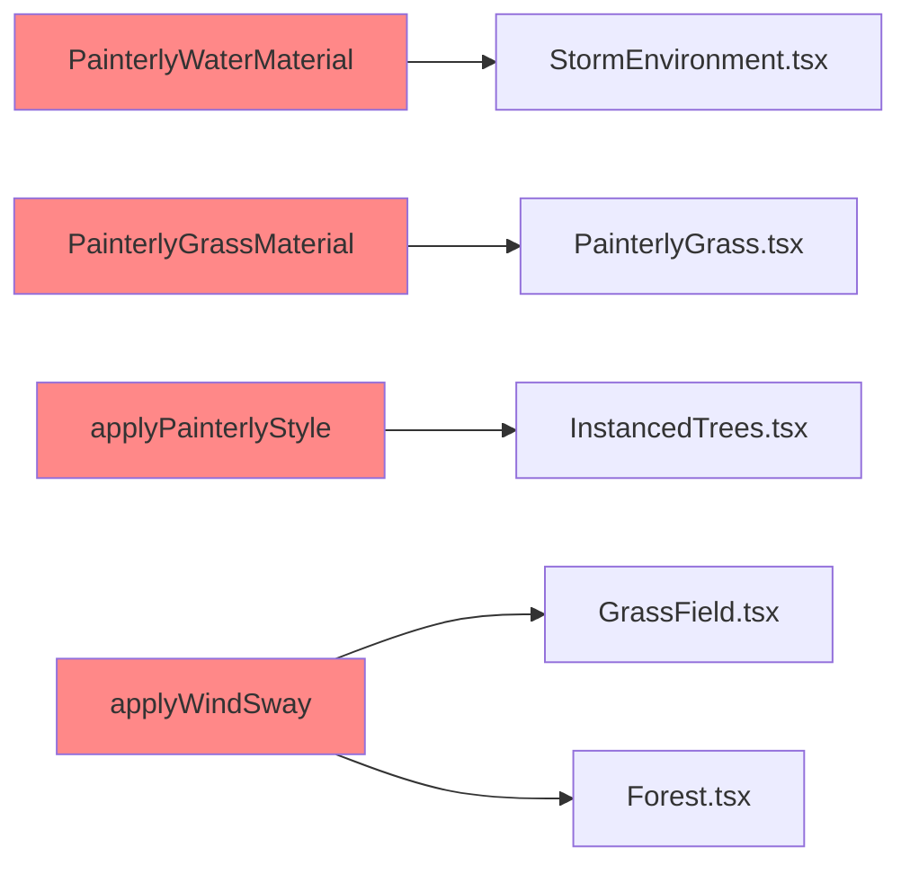

# Plan: WebGPU Migration — packages/

## Summary

5 GLSL items in `packages/shared/` still use `ShaderMaterial` or `onBeforeCompile` hooks.
These don't work with `WebGPURenderer`. Need conversion to `NodeMaterial`+TSL or dual-path.

## Files to Modify

### 1. `packages/shared/src/painterly-materials.ts` — 3 materials + 1 utility

#### `PainterlyWaterMaterial` (used by StormEnvironment.tsx)

- **Current**: `ShaderMaterial` with wave displacement vertex + brushstroke/toonMix fragment + `uniforms.time` updated in useFrame.
- **Target**: `NodeMaterial` with TSL wave displacement via `positionWorld`, time-based animation.
- **TSL plan**:
    - `wave = sin(positionWorld.x * 0.2 + time * 1.5) * 0.1 + cos(positionWorld.z * 0.15 + time * 1.2) * 0.08`
    - Vertex displacement: `positionLocal.add(vec3(0, wave, 0))` — need to check if NodeMaterial supports positionLocal override.
    - Fragment: brushstroke noise built with TSL `sin`/`cos`/`fract` math.
    - `colorNode` = toonMix of color1/color2 via `floor()` stepping.
    - Remove `uniforms.time` update from StormEnvironment.tsx.

- **Dual-path**: None. NodeMaterial works on both WebGL+WebGPU.

#### `PainterlyTerrainMaterial` (dead code — not used)

- Mark deprecated, add `@deprecated` JSDoc. No conversion needed.

#### `PainterlyGrassMaterial` (used by PainterlyGrass.tsx)

- **Current**: `ShaderMaterial` with wind vertex sway + brushstroke/toonMix fragment + `uniforms.time` updated.
- **Target**: `NodeMaterial` with:
    - Vertex wind sway: `positionLocal.x += sin(time * 2.0 + worldPos.x * 0.1 + worldPos.z * 0.05) * 0.4 * positionLocal.y`
    - Color: mix of color1/color2 via `vY` + noise.
- **Remove** `uniforms.time` update from PainterlyGrass.tsx useFrame.
- **InstancedMesh**: NodeMaterial reads instanceMatrix automatically.

#### `applyPainterlyStyle(mat)` (used by InstancedTrees.tsx)

- **Current**: `onBeforeCompile` hook injecting brushstroke noise + rim lighting into any MeshStandardMaterial.
- **Problem**: `onBeforeCompile` doesn't work with `WebGPURenderer`.
- **Target**: Dual-path:
    - WebGL: keep `onBeforeCompile` as-is.
    - WebGPU: return a `NodeMaterial` clone that applies painterly effects via TSL nodes.
    - Detection: check `renderer.isWebGPUBackend` ??? No — materials don't have renderer context.
    - **Better approach**: Create `PainterlyNodeMaterialFactory` that returns NodeMaterial with the painterly TSL nodes baked in. Consumer (InstancedTrees.tsx) uses it instead of `applyPainterlyStyle`.
    - **Ponytail**: For WebGPU, skip painterly effect on loaded GLB materials (too complex to convert arbitrary onBeforeCompile). Only use PainterlyNodeMaterial for known materials.
    - **Upgrade path**: When GLB materials need painterly effects in WebGPU, need custom NodeMaterial per asset type.

### 2. `packages/shared/src/wind.ts` — 1 utility

#### `applyWindSway(material, path)` (used by GrassField.tsx, Forest.tsx)

- **Current**: `onBeforeCompile` hook injecting wind sway vertex code.
- **Problem**: Same — `onBeforeCompile` doesn't work with WebGPU.
- **Target**: Dual-path:
    - WebGL: keep `onBeforeCompile` as-is.
    - WebGPU: For _new_ materials, add wind sway as `NodeMaterial` positionLocal override.
    - For _loaded_ materials (GLB): ponytail — wind sway not applied in WebGPU mode.
    - **Alternative lighter approach**: In GrassField.tsx and Forest.tsx, detect renderer type. If WebGPU, apply wind via a custom onBeforeCompile skip OR use CPU-based sway.

- **Actually**: `applyWindSway` applies to materials from loaded GLB files (trees, grass props). Converting arbitrary GLB materials to NodeMaterial is not practical. **Ponytail**: skip wind sway in WebGPU mode.

## Consumer Files That Need Updates

### `frontend/src/components/game/environment/StormEnvironment.tsx`

- Remove `PainterlyWaterMaterial.uniforms.time.value = state.clock.elapsedTime;` (line 72-74)
- NodeMaterial reads `time` from TSL automatically.

### `frontend/src/components/game/environment/effects/PainterlyGrass.tsx`

- Remove `PainterlyGrassMaterial.uniforms.time.value = state.clock.elapsedTime;` (line 84-86)
- NodeMaterial reads `time` from TSL automatically.
- Change `<primitive object={PainterlyGrassMaterial} attach="material" />` → use in-memo material.

### `frontend/src/components/game/environment/effects/InstancedTrees.tsx`

- `applyPainterlyStyle(mat)` — convert to use PainterlyNodeMaterial for WebGPU.
- Or: detect renderer mode and skip painterly style for WebGPU.

## Order of Implementation

1. Convert `PainterlyWaterMaterial` → NodeMaterial (most used, simplest TSL conversion)
2. Convert `PainterlyGrassMaterial` → NodeMaterial (straightforward TSL)
3. Handle `applyPainterlyStyle` — dual-path or ponytail
4. Handle `applyWindSway` — dual-path or ponytail
5. Update consumer files (remove uniform.time updates)
6. Verify build compiles

## Mermaid: Package Dependency

## Risk / Complexity

| Item                   | Complexity | Notes                                                                      |
| ---------------------- | ---------- | -------------------------------------------------------------------------- |
| PainterlyWaterMaterial | Low        | Vertex displacement + color mix, straightforward TSL                       |
| PainterlyGrassMaterial | Low        | Vertex wind sway + color mix, straightforward TSL                          |
| applyPainterlyStyle    | High       | onBeforeCompile tidak bisa di-replace 1:1 di WebGPU. Need skip or factory. |
| applyWindSway          | Medium     | Butuh renderer detection. Skip on WebGPU or use factory.                   |
