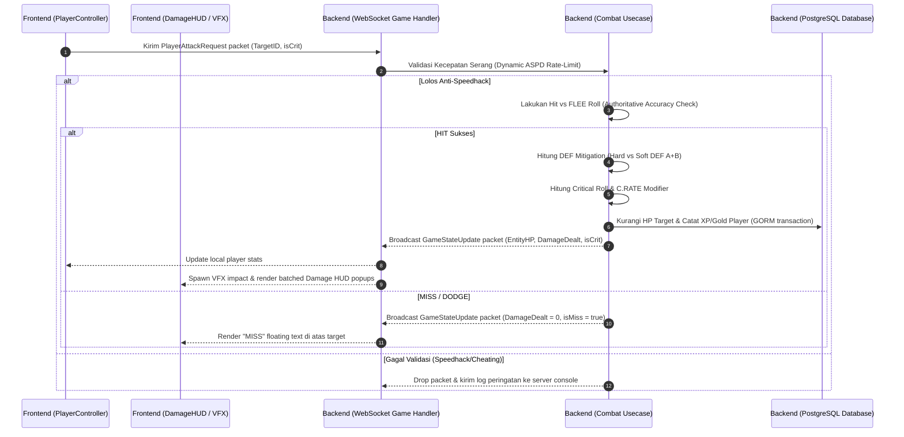

# 🏛️ MMORPG Stats & Combat Engine Architecture Wiki

Selamat datang di repositori arsitektur internal untuk sistem **Statistik, Formula Combat, dan Sinkronisasi Engine** Ragnarok Online (Renewal & 4th Class) pada game MMORPG Anda.

Daftar dokumen di dalam wiki ini dirancang secara terstruktur untuk menjelaskan alur data pertempuran dari sisi server (*authoritative backend*) hingga rendering visual grafis 3D sisi client (*frontend interface*).

---

## 🗺️ Peta Navigasi Arsitektur (Architecture Map)

Dokumentasi ini dibagi menjadi 8 tahap panduan implementasi langkah-demi-langkah (*step-by-step implementation steps*):

```
wiki/architecture/
├── 📄 README.md                          <-- (Anda sedang berada di sini)
├── 📄 00_context_bootstrap.md           <-- Tahap 0: Konteks Global, Folder Tree & DONT_TOUCH Guardrails
├── 📄 01_backend_domain.md              <-- Tahap 1: Struktur Atribut & GORM Persistence
├── 📄 02_backend_combat.md              <-- Tahap 2: Authoritative Combat usecases & Hit rolls
├── 📄 03_frontend_state.md              <-- Tahap 3: Alokasi Poin & Payload Websocket Sync
├── 📄 04_frontend_combat_ui.md          <-- Tahap 4: ASPD Animation Sync & Batched Damage Popups
├── 📄 05_database_migrations.md         <-- Tahap 5: GORM Database Migrations & Seeding
├── 📄 06_combat_formula_ref.md          <-- Tahap 6: Combat Formula Reference Sheet (iRO Renewal)
└── 📄 07_network_sync_protocol.md       <-- Tahap 7: Network Sync Protocol & JSON Schema
```

### 🎯 Alur Siklus Aksi Tempur (Combat Loop Life-cycle)

Setiap serangan atau perapalan skill mengikuti siklus data berikut untuk memastikan pertempuran aman dari manipulasi memori (*anti-speedhack*) dan tetap responsif secara visual:



---

## 🛠️ Ringkasan Tahapan Implementasi

Untuk menerapkan arsitektur statistik dan combat secara lengkap, ikuti panduan detail berikut secara berurutan:

### [Tahap 0: Global Architecture & Context Bootstrap](file:///home/yoga/Dokumen/game%20mmorpg/wiki/architecture/00_context_bootstrap.md)
*   Memetakan seluruh direktori folder di workspace game MMORPG Anda.
*   Menguraikan daftar batasan desain kritis (*critical performance constraints*) dari `DONT_TOUCH.md` agar server dan client tetap optimal.
*   Menghubungkan pustaka dependensi utama hibrida WebSocket, MessagePack, Redis, dan PostgreSQL.

### [Tahap 1: Backend Domain & Recalculate Logic](file:///home/yoga/Dokumen/game%20mmorpg/wiki/architecture/01_backend_domain.md)
*   Menambahkan kolom **Talent Stats (POW, STA, WIS, SPL, CON, CRT)** pada struct `Player` di Go.
*   Mengimplementasikan fungsi `RecalculateStats()` dengan scaling persentase stat baru.
*   Membuat mekanisme migrasi database PostgreSQL menggunakan GORM.

### [Tahap 2: Backend Combat Usecase & Accuracy Checks](file:///home/yoga/Dokumen/game%20mmorpg/wiki/architecture/02_backend_combat.md)
*   Membuat validasi rate-limiting serangan authoritative berskala milidetik.
*   Menerapkan kalkulasi mitigasi Hard DEF vs. Soft DEF ($A + B$) musuh.
*   Mengintegrasikan perhitungan peluang akurasi fisik (HIT vs. FLEE) dan *Critical Hit Shield*.

### [Tahap 3: Frontend Client State & Allocation Sync](file:///home/yoga/Dokumen/game%20mmorpg/wiki/architecture/03_frontend_state.md)
*   Membangun panel menu karakter untuk penambahan poin stat primer dan talent.
*   Menerapkan payload WebSocket dua arah untuk sinkronisasi nilai stat baru secara real-time.

### [Tahap 4: Frontend Combat UI, ASPD & Visual VFX](file:///home/yoga/Dokumen/game%20mmorpg/wiki/architecture/04_frontend_combat_ui.md)
*   Sinkronisasi kecepatan klip animasi fisik serang (*timeScale*) dengan dynamic ASPD backend.
*   Membuat sistem target cast time visual yang terbagi atas Fixed (FCT) dan Variable (VCT).
*   Batching render popup kerusakan tebal (Damage HUD) yang ringan di CPU/GPU.

### [Tahap 5: GORM Database Migrations & Seeding](file:///home/yoga/Dokumen/game%20mmorpg/wiki/architecture/05_database_migrations.md)
*   Mengonfigurasi auto-migration di koneksi database PostgreSQL menggunakan driver GORM.
*   Menghindari hilangnya data lama (*data loss prevention*) dengan pemetaan GORM column aliases.
*   Mengimplementasikan pemuatan data awal default (*initial seed data*) untuk karakter baru.

### [Tahap 6: Combat Formula Reference Sheet (iRO Renewal)](file:///home/yoga/Dokumen/game%20mmorpg/wiki/architecture/06_combat_formula_ref.md)
*   Kompilasi matematis untuk derived Status ATK/MATK primer dan sekunder.
*   Formula mitigasi pertahanan fisik/sihir Hard vs Soft DEF ($A + B$) dan absorpsi RES/MRES.
*   Persamaan kalkulasi peluang akurasi HIT vs FLEE, Perfect Dodge, dan reduksi Variable Cast Time.

### [Tahap 7: Network Sync Protocol & JSON Schema](file:///home/yoga/Dokumen/game%20mmorpg/wiki/architecture/07_network_sync_protocol.md)
*   Spesifikasi format payload JSON dua arah untuk alokasi stat dan aksi serangan tempur.
*   Siklus detak sinkronisasi state jaringan (*30 ticks-per-second state broadcast*).
*   Event temporal instan untuk rendering popup kerusakan visual sisi client.
